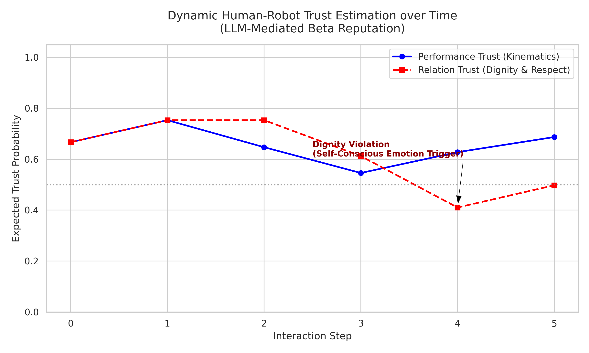

# Neuro-Symbolic Beta Reputation Tracker for HRC

## Overview
This repository contains a Conceptual Proof-of-Concept (PoC) demonstrating the real-time fusion of **Moral Psychology (Dignitarian Ethics)** and **Probabilistic Robotics (Beta Reputation)**. 

It addresses the fundamental bottleneck in modern Human-Robot Collaboration (HRC): transitioning from passive, performance-based trust estimation to active, relation-based moral arbitration.

## The Core Concept
Current models efficiently track *performance-based* trust using Beta distributions (e.g., *Dagdanov, Andrejevic, Liu, 2025*), but struggle to quantify *relation-based* trust. Meanwhile, moral psychology emphasizes that dignity violations involve the triggering of self-conscious emotions like humiliation (*Andrejevic et al., 2025*). 

This PoC bridges the gap:
1. **Semantic Evaluation:** Evaluates real-time HRC scenarios, distinguishing between mechanical errors, respect violations, and dignity violations.
2. **Mathematical Updating:** Translates the moral assessment into continuous reward/penalty scalar values, dynamically updating a Beta Reputation model.

## 🚀 The Edge AI Vision: Local LLMs for Zero-Latency Robotics
*Note: This specific Python simulation utilizes the Cloud Gemini API as a high-level proxy to demonstrate the logical architecture.* 

However, relying on Cloud APIs is an anti-pattern for real-time, physical robotics due to latency and connectivity constraints. In the fully realized PhD project, this architecture is designed to run entirely locally at the edge. 

We propose fine-tuning highly optimized, open-weight Edge LLMs (such as **Google's Gemma 3 4B** or **Microsoft's Phi-4-Mini**) specifically on dignity/humiliation datasets. Deployed on hardware like the **NVIDIA Jetson Orin NX**, this will allow for ultra-low latency (<100ms), offline, and privacy-preserving moral arbitration in a closed-loop with multimodal physiological inputs (EEG/TDA).

## Results Visualization

*Conceptual Architecture developed by Saleh Estaki.*
